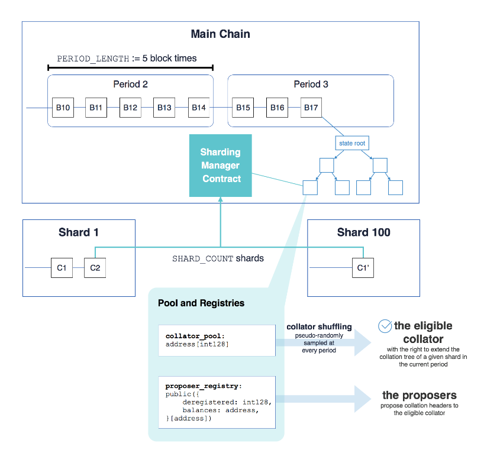
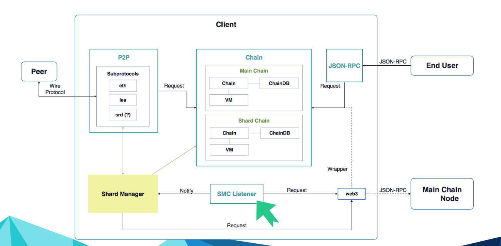

### 以太坊的分片技术
[官方资料](https://github.com/ethereum/wiki/wiki/Sharding-introduction-R&D-compendium)

##### 目标
1. Scaling: 可伸缩性，即性能能够达到VISA水平，千级TPS
2. 可用性：
   - 跨智能合约交易
   - 跨片交易
3. 紧耦合

##### Collation——校对数据结构
Collation Header
- shard_id: the Shard ID of shards, most like a network-id, from 0~N-1(N is shard number).
- parent_hash: the hash of parent collation.
- chunk_root: 类似于默克尔树root的一个字段，是对body里面的chunks的root.
- period（周期）: 进行校对的周期. (主链上五个区块算一个周期)
- proposer_bid: 该collation的提案人的地址.
- proposer_signature: 提案人的签名.

Collation Body
- chunks: list-chunks

#### 整体概览
两层和三个步骤：
- 第一层
  - 提案人(Proposer)收集交易放入到Collations中
  - 校对人(Collator校对
    - a: 链接Collations
    - b: 同意规范链
- 第二层
  - 执行人(Executor)
    - a: 处理交易
    - b: 执行智能合约
    - c: 计算状态

##### Proposer
1. 任何人都可以成为Proposer
2. 运行管理一个交易池
3. 收集所有的交易进行打包
4. 发送和接收Collation Body

##### Collator
1. 被伪随机抽样为来自所有碎片的整理池的“特定碎片和特定时期”的合格的整理者
2. 整理提案来构建排序规则

##### Executor
1. 执行状态转换功能
2. 提议者最好也应该是执行者，这样可以知道交易的消耗的gas，并选择费用高的交易

#### Sharding Manager Contract（SMC）

#### 执行流程
1. 验证者通过查看LOOKHEAD, 就是先前的区块链信息去判别接下来的验证者身份
2. 普通用户提交交易到proposer
3. proposer打包出collations并分一些gas去给验证者
4. 验证者传输接收潜在的collations
5. 验证验证直到一定的深度的片段
6. 验证者提交所验证的片段的深度给root chain
7. 恶意的验证者会提交一个非法的collation
8. 下一阶段的验证将在此分叉处处理这个非法的collation, 选取前一个合法的collation提交给root chain

#### 分片方案与现有架构的整合图

### Sharding FAQ
##### 三个简单的实现扩容的方案
1. 不再使用单一的链结构。但是这样会加多N-因子，导致安全性的下降
2. 提高区块的大小。但是这种方案将导致很多弱连接的节点下线，最终成为集中式的中心化结局
3. 联合挖矿。所有的矿工一起挖，共享收益，但是这种方式将导致矿工的成本增加，原理上还是和提高区块大小一样

##### 扩展性的难题
1. Decentralization（分散化）。任何设备接入并且只都能提供O(c)的资源
2. Scalability（可扩展性）。能够处理O(n) > O(c)的交易
3. Security（安全性）。能够抵御O(n)资源的攻击

c指单节点能够提供的有效资源(计算，带宽，存储)，n指整个生态的规模，交易负载，存储状态大小，数字货币价值都与n成正比。

#### What are some moderately simple but only partial ways of solving the scalability problem ? 什么是解决可伸缩性问题的一些中等简单但仅部分的方法？
早期的分片思想和后来的Zilliqa, Merklix tree都是在使用分片或者碎片技术来解决吞吐量的问题，主要用于解决交易吞吐量的问题，但是没有考虑存储的代价。要全面解决这些问题，还需要解决状态存储，事务执行和广播机制都全面调整。需要深入到P2P层

#### 并没有走分片路线的其他方法？
1. 用拜占庭协议去改造区块链共识形态: Bitcoin-NG
2. 使用外部通道和off-chain加速: Lightning Network，Raiden
3. 使用密码学来改造： Mimblewimble，zk-SNARKs

