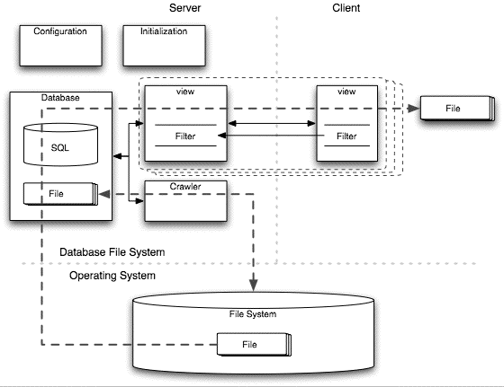

### Overlay Database
将信息以文件的形式存储，并以一定的数据结构组织，通过在上面封装一层类数据库的程序，像数据库一样提供用户使用的接口。

- 第一层：User interface 用户接口
- 第二层：Database interface to files 对文件的数据库接口
- 第三层：Existing hierarchical filesystem 现有的分层文件系统
- 第四层：Storage media 存储媒介

两个著名的实现:
- [WinFS](https://en.wikipedia.org/wiki/WinFS): 以NTFS作为底层文件存储系统
- [DBFS](http://dbfs.sourceforge.net/)： 开源的实现

