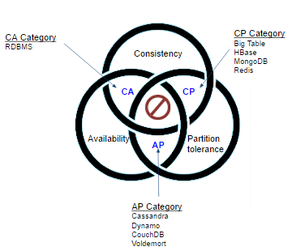

### CAP理论
[WIKI观点](https://en.wikipedia.org/wiki/CAP_theorem)

[证明论文](https://www.comp.nus.edu.sg/~gilbert/pubs/BrewersConjecture-SigAct.pdf)

[关于Bitcoin在CAP中的地位](https://www.goland.org/blockchain_and_cap/)

#### 区块链（比特币）处在CAP中的什么位置？
首先传统区块链系统是满足分区容错的，所以有一个P，至于是CP, 还是AP，取决于对于客户端或者说用户的设置。
-. 如果用户觉得收到区块，就相信这个区块，那么就是AP
-. 如果用户觉得必须等到六个区块确认后，才可以正常使用，那么区块链就是个CP

#### DAG处在CAP中的什么位置？
DAG也是具有分区容错的，所以也有一个P，但是DAG就是一个AP
- 因为用户不用担心双花的问题，因为随时可以使用账户，任何交易都不会被DAG网络丢弃
- 用户想要判别出交易是否有效，必须要等待很长一段时间，通过其他对比算法才能得到最终结果

CAP想要知道一个系统在某个时期到底是选择了CA，还是AP，这是有一个前提的，那就是分区-P，在知道产生了分区的情况下才会出现选择A，还是C的问题。在传统的分布式存储中，想要知道是否出现分区的特征是与其他的主机网络通信断开了。这个时候，系统可以知道自己处在了分区容错阶段，但是区块链系统因为是完全的P2P系统，一个主机并不是通过是否与网络其他Peers断开来判断自己是否处在分区中，而是通过收到区块，区块是否出现了分叉了判断自己是否处于分区中，如果主机判断自己现在出现了分叉，而且这个分叉是没有办法立即得到分区容错结果的，那么这个时候区块对外提供服务的时候，选择了A，还是P才有意义。也就是说，当区块链节点收到两个区块，出现分叉的时候，是否对外继续提供有效服务，如果提供有效服务，那么就是选择了可用性，如果不提供有效服务，也就是不提供是否接受交易并广播的反馈，那么就是选择了一致性。这点需要代码层次了解。这也就是说需要不同的客户端实现才能确认。如果客户端的实现是接受交易并立马广播出去，那么就是可用性，如果客户端只接受交易但是并不对这个交易进行广播和处理（写入操作），那就是选择了一致性。
